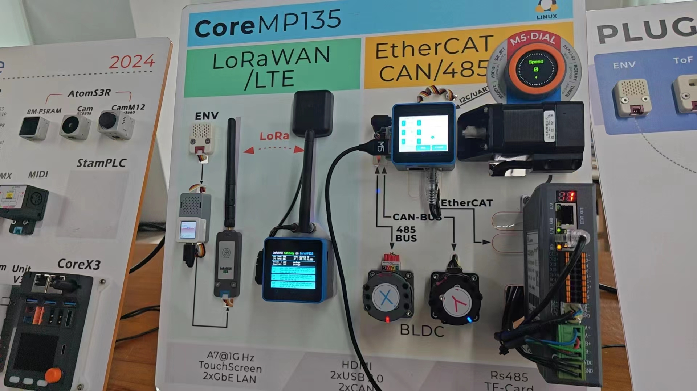

# coremp135_lora_demo
This is a display demo of a CoreMP135 serving as a LoraWAN gateway. After deploying ChirpStack on CoreMP135, it communicates with ChirpStack via MQTT. It accomplishes the transmission and reception of information for LoraWAN devices.

## Effect
